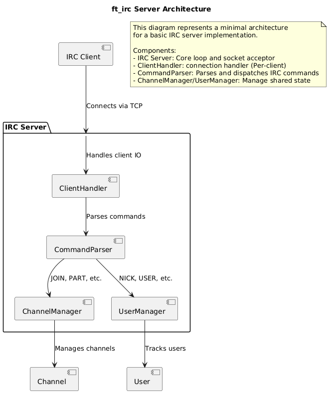

# ft_irc

**ft_irc** is a simplified IRC (Internet Relay Chat) server implemented in C++. The project aims to explore network programming, socket communication, and server/client architecture.

## 📖 Overview

The primary goal of ft_irc is to provide a functional IRC server that allows multiple users to connect, join channels, and exchange messages in real time — all while adhering to a subset of the RFC 1459 specification. It emphasizes the use of low-level socket programming and an event-driven architecture without relying on high-level frameworks or external libraries.

This project was developed in C++ as part of the 42 common core. It is fully compatible with official IRC clients such as WeeChat, Irssi, and Halloy.
We used Irssi and Halloy as our reference clients.

## ✨ Features
**ft_irc** supports a range of core IRC functionalities, allowing users to communicate and manage channels effectively. Key features include:

✅ **Channel Management**

- Create or join channels dynamically
- Set or view channel topics
- Invite users to private channels
- Kick users from channels

💬 **Messaging**

- Send private messages (PRIVMSG) to users or channels
- Channel message caching for forwarding to newly joined users

🛡️ **Channel Modes**

The server supports common IRC modes with + / - syntax:

- o – Operator privileges
- l – Channel user limit
- k – Password-protected channels
- t – Topic protection (only ops can change)
- i – Invite-only channels

🔐 **User Management**

- Nickname and user setup
- Password authentication
- RFC-compliant server responses

🤖 **Extras**
- Built-in censorship bot for filtering specific words
- Base64 file transfer support between users


## ⚙️ Requirements

- Linux distro
- GCC or Clang
- Make

## 🛠️ Installation

Clone the repository:

```bash
git clone https://github.com/itsYakub/42-ft_irc
cd ft_irc
```

Build the project:
```bash
make
```

Run ft_irc with a valid port and password:
```bash
./ircserv <port> <password>
```
## 🚀 Usage

Connect to the server via your chosen client and authenticate with NICK USER & PASS commands. The server logs all incoming messages and events. Now you can chat!

## 🧱 Architecture
The internal design of ft_irc follows a modular and event-driven architecture, built around non-blocking I/O using the poll() system call. The server handles multiple client connections simultaneously and processes IRC commands using a command parser-dispatch system.

The core components include:

### Server
Initializes sockets, accepts new connections, and drives the main poll loop. It manages the overall lifecycle and communication flow between clients and channels.

### Client
Represents a connected user. Stores nickname, connection state, buffer data, and authentication status.

### Channel
Manages a single IRC channel. Tracks users, operators, topic, modes, and internal cache for message forwarding.
### CommandHandler
Parses and executes IRC commands (JOIN, PRIVMSG, MODE, etc.). Delegates logic to relevant channel or client objects and ensures RFC-compliant responses.

### Other
* Bot Module: Monitors messages and filters content based on the configured banned words.

* Cache System: Stores channel messages for new clients joining mid-conversation.

* File Transfer Handler: Supports base64-encoded file sending in a user → server → user chain.

## 🖼 Diagram

Note: This diagram illustrates the high-level relationships between components and the flow of data within the server.


## 📁 Additional Info
* The server gracefully handles SIGINT, triggering a clean shutdown that removes cache files and frees all dynamically allocated memory.

* Channel message caches are stored in corresponding files for temporary persistence.

* Banned words for the censorship bot can be configured by editing the file located at:
```
    ./config/banned.txt
```

## Notes 📌
👀 If you notice any bugs, feel free to fork the repository & submit a pull request!

📢 If you're a 42 student, use this as a guide at most. Don't cheat, learn! <3

📅 Created in June 2025 as part of 42's Common Core at 42 Warsaw

## 📄 License
This project is licensed under the MIT License. See LICENSE for details.

## 👨‍💻 Authors
https://github.com/bobbyskywalker

https://github.com/itsYakub
